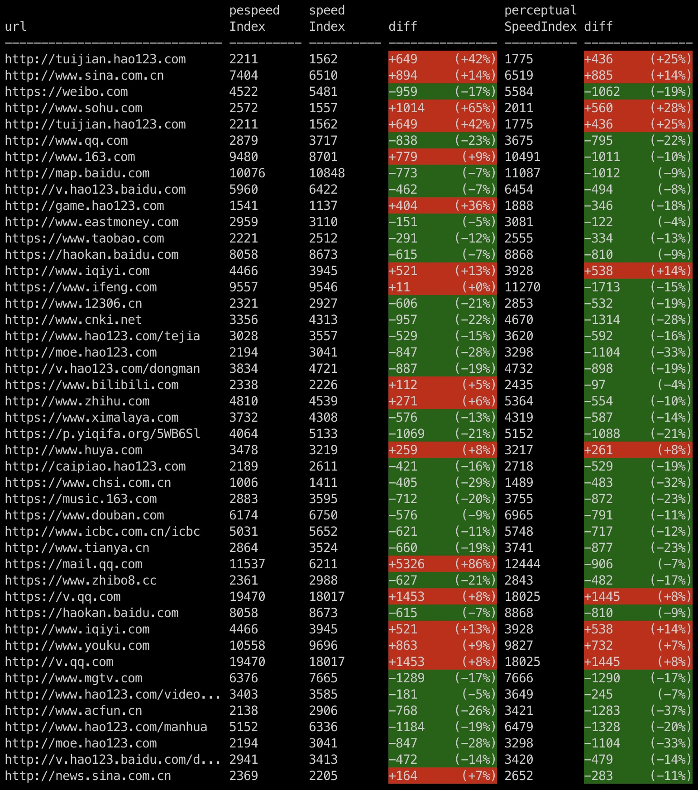

# Paint Events Speed Index

This project is trying to calculate the speed index from Paint Events that are exposed by Webkit through the developer tools timeline.

There is already a project named [speedline](https://github.com/paulirish/speedline) that is implemented for this goal. But our project wants to optimize the speed to get the result without using screenshot, which is used in speedline. Moreover, our project's final goal is to get higher the degree of accurancy than, or at lease the same as the speedline.

This project is inspired by [WebPageTest](https://sites.google.com/a/webpagetest.org/docs/using-webpagetest/metrics/speed-index), and the algorithm we used is similar to WebPageTest's. Need to say that we would like to optimize the algorithm in future.

The algorithm of visual progress we used in project is like this (copied from WebPageTest):

* In the case of Webkit-based browsers, we collect the timeline data which includes paint rects as well as other useful events.
* We filter out any paint events that occur before the first layout that happens after the first response data is received.
  * ResourceReceiveResponse -> Layout -> Paint events.
  * This is done because the browser does several paint events before any data has actually been processed.
* We group all paint events by the rectangle that they are updating (frame ID, x, y, width, height).
* We consider the largest paint rectangle painted to be the "full screen" rectangle.
* Each rectangle contributes a score towards an overall total.  The available points for a given rectangle is that rectangle's area (width x height).
* Full screen paints (any paint events for the largest rectangle) are counted as 50% so that they still contribute but do not dominate the progress.
* The overall total is the sum of the points for each rectangle.
* The points for a given rectangle are divided evenly across all of the paint events that painted that rectangle.
  * A rectangle with a single paint event will have the full area as it's contribution.
  * A rectangle with 4 paint events will contribute 25% of it's area for each paint event.
* The endTime for any given paint event is used for the time of that paint event.
* The visual progress is calculated by adding each paint event's contribution to a running total, approaching the overall total (100%).

## Command-Line Usage
```shell
# global install
yarn global add paint-events-speed-index
pespeedindex ./timeline.json 1920 1080
# or
npm install -g paint-events-speed-index
pespeedindex ./timeline.json 1920 1080

# local install
yarn add paint-events-speed-index
yarn run pespeedindex
# or
npm install paint-events-speed-index
npx pespeedindex
```

## Development

```shell
# install dependencies
yarn
# or
npm install

# build
yarn build
# or
npm run build

# test
yarn test
# or
npm run test

# watch & test
yarn watch
# or
npm run watch
```

## Benchmark
Run following command to run benchmark test
```shell
yarn benchmark
# or
npm run benchmark
```
Then, we got following benchmark data:



There are hundreds of timeline data files in the project. We run benchmark test on these files.

* url: page url of timeline data 
* pespeedIndex: speedIndex calculated by the algorithm provided by this project
* speedIndex: speedIndex calculated by speedline
* first diff: difference between pespeedIndex and speedIndex (pespeedIndex - speedIndex)
* perceptualSpeedIndex: perceptualSpeedIndex calculated by speedline 
* second diff: difference between pespeedIndex and perceptualSpeedIndex (pespeedIndex - perceptualSpeedIndex) 


## License

MIT © [Jianfeng](https://github.com/zhujianfeng)